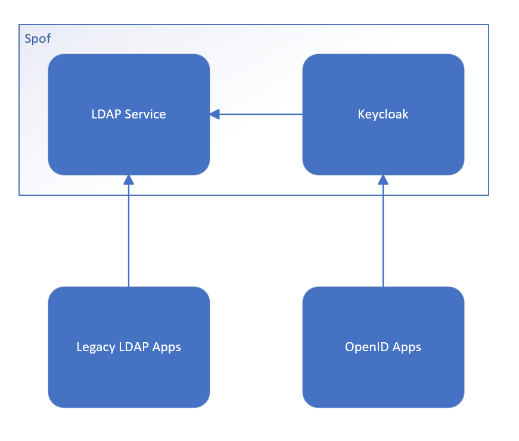
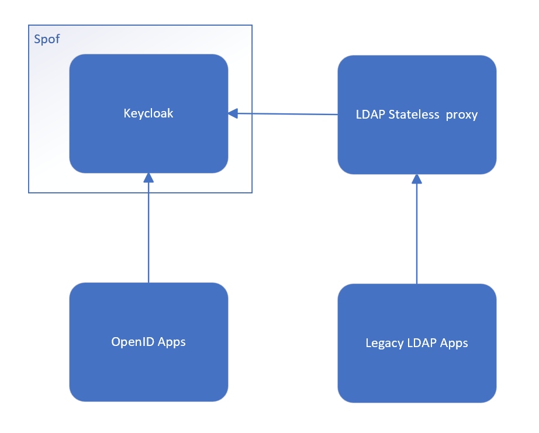
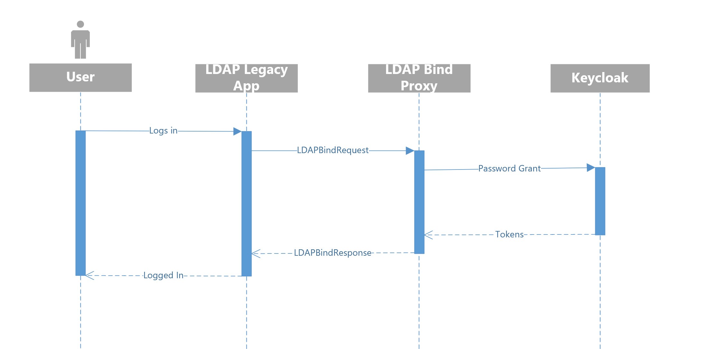
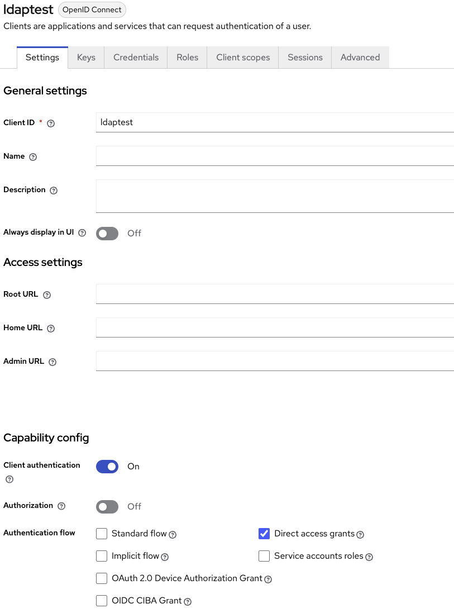

# Get rid of your old Active directory/LDAP with keycloak and a small piece of custom software

## TL;DR

How to spawn a simple bind LDAP proxy for keycloak OIDC password grant in a nutshell.

## Disclaimer and license

The principles and code presented here are only a proof of concept and shouldn't be used in production as is. Use it at your own risks. If you see any problem with the concept or its implementation feel free to open an issue or submit a pull request on github. [https://github.com/please-openit/LDAP-Bind-Proxy](https://github.com/please-openit/LDAP-Bind-Proxy)

This proof of concept is distributed under the Apache 2.0 license. See LICENSE.md in the git repository.

## LDAP/AD is more and more a legacy service but not always

If you are using Active directory as your main user management tool and are happy with it this article may not be meant for you.
There is no problem with using Active directory or LDAP at the core of your system, this article is meant for those who have to deal with one or two legacy software supporting only LDAP protocol.

In such a case, the common way to do it with keycloak is to use an OpenLDAP as the keycloak user backend. This allows to enable both OpenId Connect and LDAP but it has major drawbacks. If OpenLDAP fails keycloak also fails, it is a new single point of failure to your infrastructure. Thus there is the need to maintain and replicate this element. This can be a lot of work sometimes only to maintain compatibility with a non critical legacy application.



## An elegant minimalist LDAP proxy for keycloak

To deal with the situation described above, it would be nice to have a minimalist proxy to perform and translate LDAP bind request against the keycloak server. 


Keycloak implements the OpenID Connect direct password grant, this allows us to imagine a simpler and more robust architecture.



There are the same number of components but the LDAP proxy is stateless and less critical depending on the applications that rely on it.

It is also a way more simple component that can be spawned anywhere you need it even besides your client application for casual use.

## How LDAP Bind proxy works

Ldap bind proxy will simply "translate" LDAPBind request it receives to password grant request. To do so, it needs its own dedicated confidential client that allows direct access grant.



The user logs-in as he always does, the legacy app sends a LDAPBindRequest as it always does, then the LDAP Bind proxy translates it to a password grant and gives a LDAP Bind Response according to the keycloak's response.

To ensure login security, the client must be confidential and the LDAP bind proxy must be deployed on a safe network and VM to keep its client credentials secret.

## Implementation

A full demo is available on github, feel free to try it by yourself. [https://github.com/please-openit/LDAP-Bind-Proxy](https://github.com/please-openit/LDAP-Bind-Proxy)

The proof of concept relies on LDAPProxy from twisted/ldaptor for convenience reasons. But could have been built on top of any up-to-date LDAP layer.

All parameters comes from environment variables with all standard names you already knows.

- LDAP_PROXY_TOKEN_URL
- LDAP_PROXY_CLIENT_ID
- LDAP_PROXY_CLIENT_SECRET


Here is the core part of the code doing the main operation :

```python
            # Get username and password from LDAPBind request
            username = request.dn.split(b',')[0][3:]
            password = request.auth

            
            # Url of the token endpoint of OIDC provider
            url = os.environ.get("LDAP_PROXY_TOKEN_URL")
            client_id = os.environ.get("LDAP_PROXY_CLIENT_ID")
            client_secret = os.environ.get("LDAP_PROXY_CLIENT_SECRET")

            # Payload of the password grant request
            payload = 'client_id={client_id}&client_secret={client_secret}&grant_type=password&username={username}&password={password}'.format(client_id=client_id, client_secret=client_secret, username=username.decode('utf-8'), password=password.decode('utf-8'))
            headers = {
            'Content-Type': 'application/x-www-form-urlencoded'
            }

            # Doing le password grand request
            oidc_response = requests.request("POST", url, headers=headers, data=payload)

            # Logging username and status code
            print(username.decode('utf-8') + " " + str(oidc_response.status_code))


            # Build a LDAPBindResponse, succes or failure depending of the status code of the password grant request
            if oidc_response.status_code == requests.codes['ok']:
                # LDAP Bind success
                msg= pureldap.LDAPBindResponse(
                        resultCode=ldaperrors.Success.resultCode
                    )
            else:
                # Invalid credentials LDAP error 49 (see keycloak logs for details)
                msg= pureldap.LDAPBindResponse(
                        resultCode=ldaperrors.LDAPInvalidCredentials.resultCode
                    )
            reply(msg)
```

The operation used (grant_type=password) is the same as described in oidc-bash.sh : [https://github.com/please-openit/oidc-bash-client/blob/master/oidc-client.sh#L33](https://github.com/please-openit/oidc-bash-client/blob/master/oidc-client.sh#L33)


Interesting note on implementation of this poc :

The library used is designed to forward its requests to a backend LDAP server. In this case we don't want that to occur so the LDAPClient object handling upstream LDAP communication is replaced by a Mock object. A cleaner implementation using the same library is possible.

```python
    ## TODO: This is a Workaround, implement a cleaner proxy class from class ServerBase
    def connectionMade(self):
        """ Overridden method to prevent proxy from trying to connect non-existing backend server.
        Mocking client class to drop every operation made to it"""
        print("connectionMade called")
        self.client = Mock()
        ldapserver.BaseLDAPServer.connectionMade(self)
```

## Proof of concept usage

Build and start keycloak and LDAP Bind proxy from `docker compose`.

```bash
docker compose up -d --build
```

Test with `python ./ldap_client_bind.py` or any client you want.
The test binddn and the test password are the followings :
* Bind DN : cn=test,ou=people,dc=example,dc=org
* Password : pwtest

In fact in this configuration **only the CN part of the Bind DN is important** and used as username.
You can even try by yourself to create another user in keycloak (admin/admin for admin console), in that case you must login for the first time through the account console of keycloak. Any required action on the account or temporary password will block password grant. Login into the account console is the most straightforward way to ensure everything is fine.

Example using ldap-utils ldapwhoami :

```bash
$ ldapwhoami -D "cn=test,ou=people,dc=example,dc=org" -w pwtest; echo $?
0
```
In this case `ldapwhoami` sends a `LDAPExtendedRequest` to get details and the proxy response is an empty ``LDAPExtendedResponse`. Therefore there is nothing printed in the output of the command but the return code is 0 and the log of the proxy indicates a successful bind. It would be nice in the future to map some information from IDtoken to the `LDAPExtendedResponse`

Example using ldap-utils ldapsearch :

```bash
$ ldapsearch -x -D 'cn=test,ou=people,dc=example,dc=org' -w pwtest
# extended LDIF
#
# LDAPv3
# base <> (default) with scope subtree
# filter: (objectclass=*)
# requesting: ALL
#

# search result
search: 2
result: 0 Success

# numResponses: 1
```

`ldapsearch` has a more verbose output despite the fact it receives an empty `LDAPSearchResultDone`. Maybe better for testing.

Only the LDAPBindRequest is really supported, other replies are empty dummies, this will be enough for login operation but don't expect showing anything in an LDAP admin tool for now.

## Keycloak configuration

A client (with authentication) is needed. No "standard flow", of course no URI in configuration. Just "Direct access grant" enabled.



## Conclusion/Going further

This piece of code and documentation demonstrate the opportunity of such an architecture. The possibility to save a lot of time in MOC by not having to maintain an LDAP service which is often poorly integrated with modern cloud platform. Sometimes the LDAP connection depends on a VPN link between a local infrastructure and a server or cloud provider. Given the fact that keycloak relies on its LDAP backend when configured, we often recommend our clients to put an LDAP replica alongside the keycloak but this solution comes with a cost. In some cases this heavy configuration could have been avoided with a tool like the LDAP Bind proxy presented here. 

However, to date, it isn't near to be suitable for production use.

A lot of thing has to be done to make this concept ready for production, including but not limited to :
* Implement mapping with the token and a real ldapwhoami.
* Add basic read-only search.
* Track LDAP sessions and keep OpenID tokens in a key-value cache store.
* Implement real logout.

